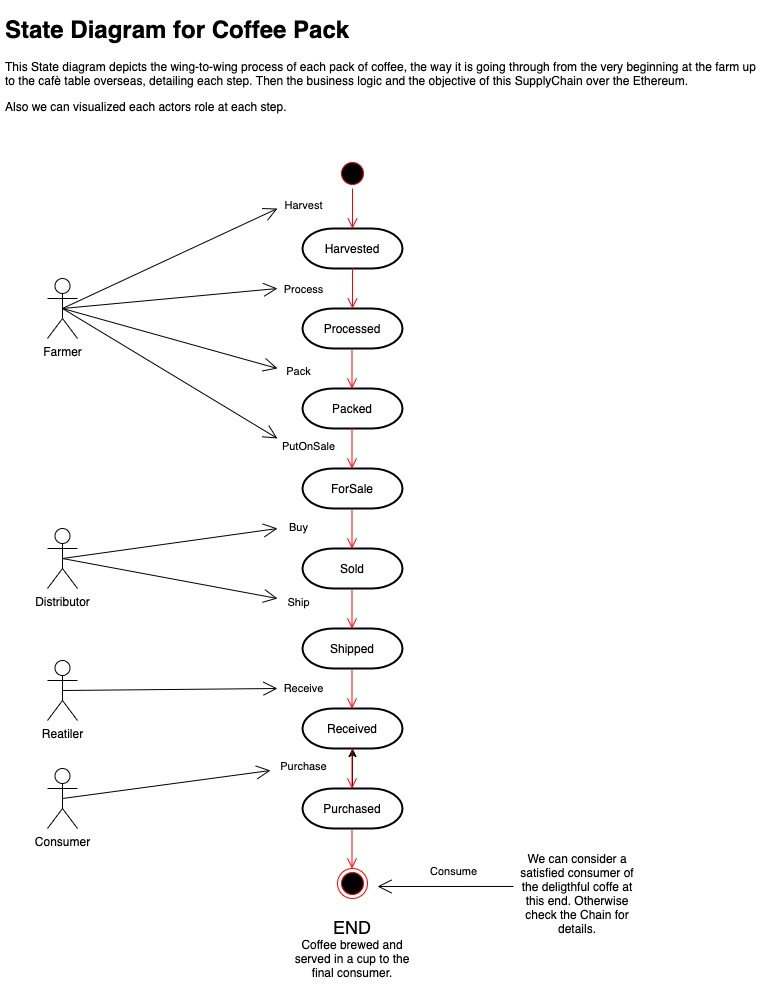
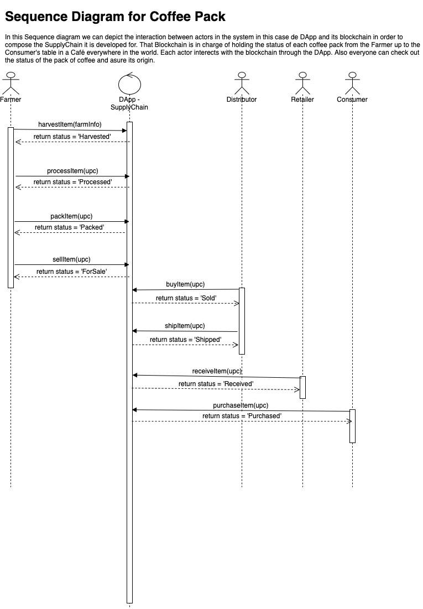
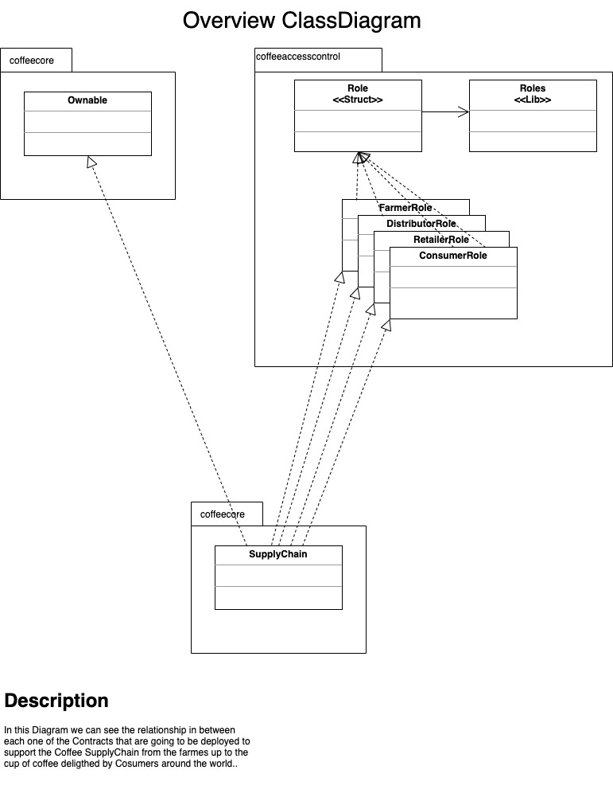
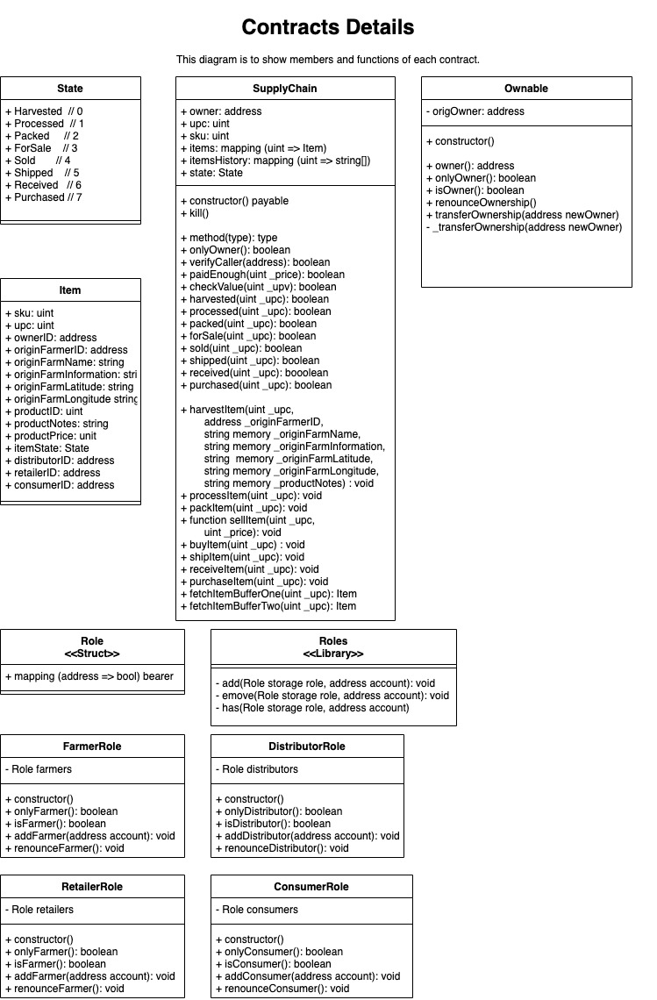

# Architect a Blockchain Supply Chain Solution - Part B

## Introduction

CoffeeBreak Company is a group of coffee farmers around the world who has been harvesting organic coffee, it means, without any kind of chemical added to the land in which the coffee grows up nor to the process of those grains. So they pack and distribute pure coffee to consumers. Then they waranty the consumer will be experiencing a high-quality and gourmet coffee in every cup they drink.

In order to asure the pack you are getting in your café from which your cup is being served, is the original one and it comes from one of those faraway organic farms somewhere around the world, CoffeeBreak Company has asked the development of a System in which everyone can check out the procedence of every pack of coffee.

Here you are the design:

## CoffeeBreak Company BlockChain Supply Chain DApp Design

### State Diagram

In this diagram, we depict the business solution. Here you can see how each Item, or more precisely, each coffee pack is going through the SupplyChain, from any of the Farmers up to you table.

### Sequence Diagram

In this diagram we depict the interaction or *activity* happening between each actor:

	- Farmer.
	- Distributor.
	- Retailer
	- Consumer

and the DApp **CoffeeBreak SupplyChain**.

### Class Diagram

In this one, we can depict the back-end classes that makes the information is correctly handled accordingly to requirements and analisys design. Here is importan to remark that non-Functional requirements are that the app was read-only publicly available, restricted to perform specific operations accordingly to the role and **untampered** by anyone else besides requirements, in this way the DApp **CoffeeBreak SupplyChain** makes sure the information is validated and reliable.

To accomplished such requirement of trust information, we decided to develop this Supply Chain solution on the BlockChain technology, in this case Ethereum Platform was choosen for such development. Then, the *Class Diagram* depicts the classes, or more precisely, the *Smart Contracts* running in ethereum Network. Those contracts were developed with Solidity (see appentix for libraries and versions utilized).

## Supply Chain Deployment

The CoffeeBreak Company BlockChain Supply Chain is currently in QA-UAT (User Acceptance Test) in a testing Ethereum environment at Rinkeby, here you are the details to check that out:

- SupplyChain Smart Contract Address: [0x8ac61dd869d1cea05bbe811e4fed2d5cd16a2baa](https://rinkeby.etherscan.io/address/0x8ac61dd869d1cea05bbe811e4fed2d5cd16a2baa)
- Deployment Transaction: [0x2408526fb348a664cb2b9e2937b834a7d5fb49760dc17e17e6021a269b0176ed](https://rinkeby.etherscan.io/tx/0x2408526fb348a664cb2b9e2937b834a7d5fb49760dc17e17e6021a269b0176ed)

## Development Appentix

1. Solidity v0.8.7 - programming language to develop Smart Contracts.
2. Truffle v5.4.5 - a development framework for Ethereum.
3. Moca v8.1.2 - for JUnit testing.
2. Ganache v2.5.4 - for integration testing.
3. Rinkeby - for User Acceptance Testing.
4. lite-server v2.4.0 - for WebApp development.
5. web3.js v1.5.2 - JavaScript library for access Ethereum network from WebApp.

